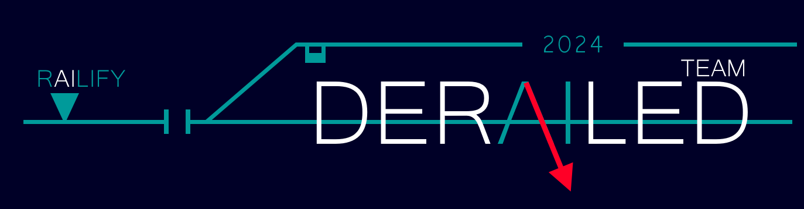
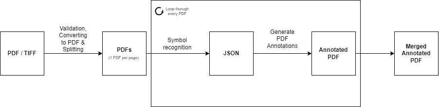
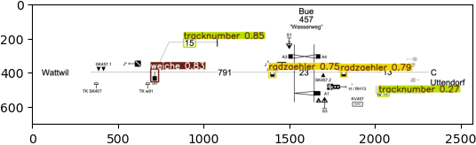
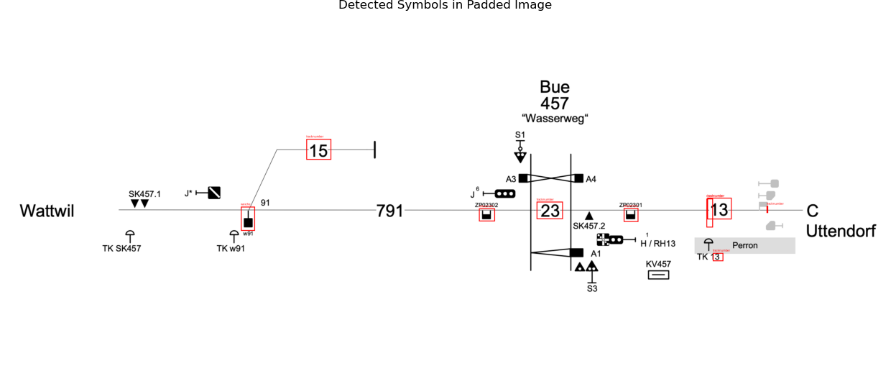
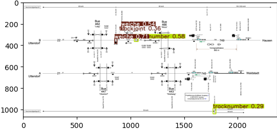
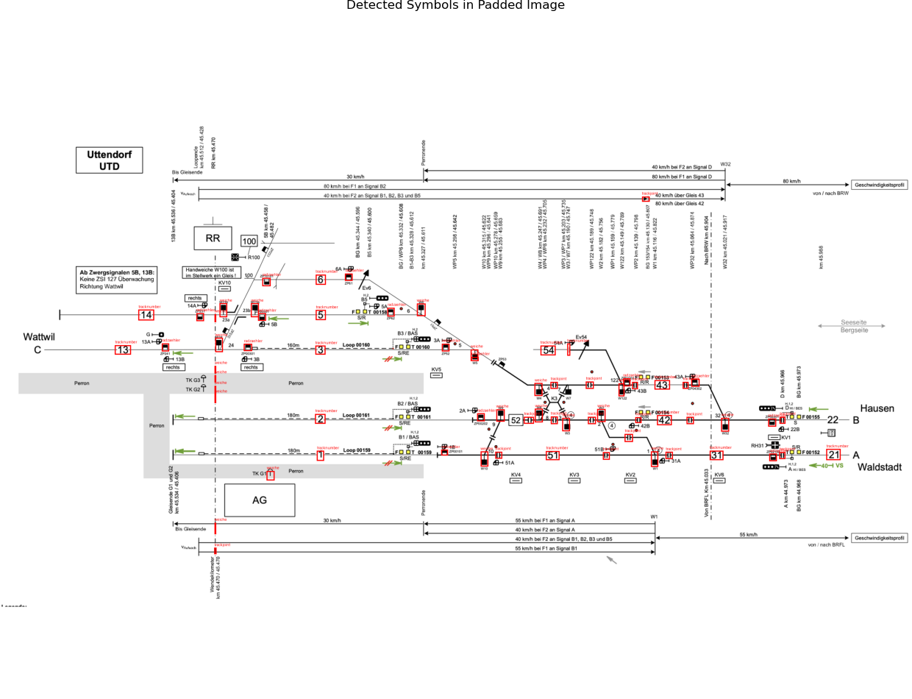
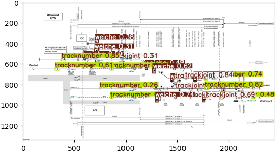
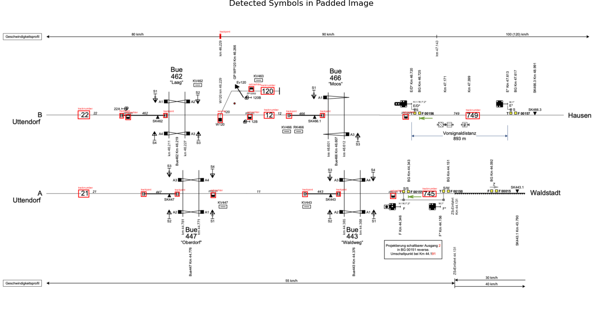

# rAIlify
rAIlify is a challenge pitched by Siemens at the 2024 [BaselHack](https://www.baselhack.ch/). 

### Task of Challenge (User Story)
As a railway engineer at Siemens Mobility, I want to utilize a digital node-edge model of my railway network. Unfortunately, information gets delivered in old school vectorized PDF and TIFF formats. I’m far too lazy to manually engineer that huge variety of visual data.

Help me to recognize tracks, switches , signals, annotations and other entities and to arrange them in a standardized model for my work. Bring us on the engineering fast track when we e.g. have to modernize interlockings or determine optimized and safe routes through the rail network. This is much more than just image recognition! The real challenge lies in the variability of how plans are drawn and how information is arranged.

My vision is to use the extracted topology data as input for further sophisticated railway solutions. To have a digital model that spans the entire engineering process and life cycle.

### Workflow Diagram

### Team Members 
* Amar Tabakovic
* Johannes Casaburi
* Adrian Altermatt
* Zora Fuchs
* Sarah Rebecca Meyer
* Patrick Schwartz
* Noah Grun

## Setup

### Visualiztion

#### Requirements

- Ruby installed (https://www.ruby-lang.org/en/documentation/installation/)
- Graphviz installed (https://graphviz.org/download/)

#### installation

1. Navigate to visualization folder: `cd code/visualization`
2. Install libraries: `bundle install`

#### Run

The application can be run with multiple files. The results will be stored in the `output` folder.

- Run application: `ruby visualizer.rb path/filename1.json path/filename2.json ...`
- Run with given example files: `ruby visualizer.rb input/example.json input/tiefengrund.json`

### Sliding Window Approach
One challenge we needed to handle was detecting symbols across a large, high-resolution image. YOLO models are typically designed for object detection on images with 640 x 640 dimensions. Since railway plans can be significantly larger than the standard input size, containing intricate details spread across a wide area, downsizing that image to a 640x640 format led to a worse recognition of the symbols by our algorithm. 

Using a sliding window approach allowed us to systematically scan the large image, splitting it into smaller, manageable segments that matched the input size required by the YOLO model. We used a window of 640 with a stride of 320. Each window was then analyzed separately, ensuring that small and detailed features present in the image are captured. Without the sliding window approach, it would have been challenging for the model to accurately identify small or densely packed symbols in the high-resolution image, as downscaling would likely lead to loss of crucial information.

This allowed us to maximize object detection without compromising the ability of the model to recognize fine details across a large-scale image.

### Extra Challenge
We ran our detection algorithms on the extra challenge that was available at 11am. To compare, we ran the same model once without the sliding window approach and once with it. 
This were the results:

Without the sliding window approach, the following symbols were recognised in the first page of the extra challenge:
2 radzaehlers, 2 tracknumbers, 1 weiche

With the sliding window approach, these symbols were recognised:
2 radzaehlers, 6 tracknumbers, 1 weiche

9 trackjoints, 9 tracknumbers, 10 weiches

15 radzaehler, 17 trackjoints, 14 tracknumbers, 21 weiches, 

1 trackjoint, 2 tracknumbers, 2 weiches

6 radzaehlers, 6 tracknumbers, 9 trackjoints, 1 weiche
